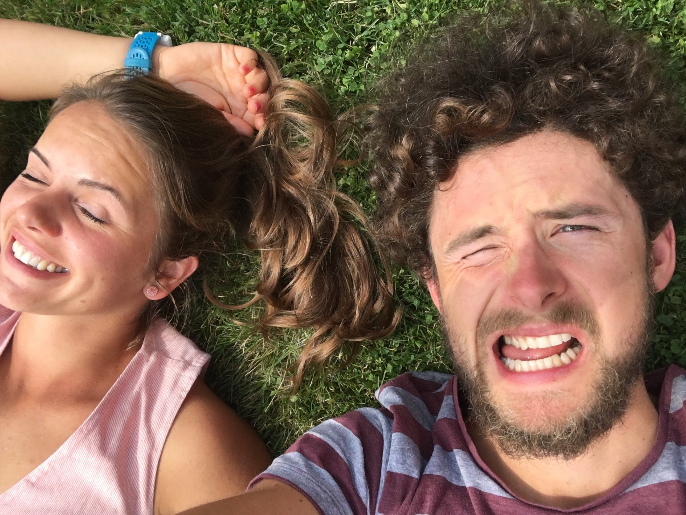
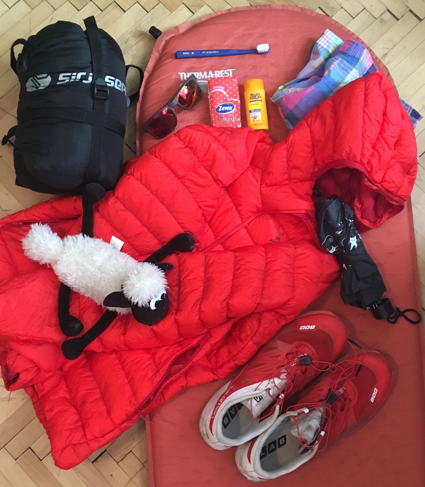

### Obřad bude 1. října ve Služátkách u kapličky Nanebevzetí Panny Marie. Přijde i pan farář.

Kaplička je to moc hezká a maj tam teďka nový obrazy. Nebo tedy nově starý, ale zrestaurovaný.
A když by někdo nevěděl, kde taková kaplička je, tak [mapy.cz to vědí](https://mapy.cz/s/YrsU).
Cesta z [Prahy na <i class="fa fa-bicycle" aria-hidden="true"></i>](https://www.strava.com/activities/338367643) trvá něco přes 4 hodiny, ale můžete použít i alternativní způsoby dopravy, třeba běh nebo auto.

>Pokud jste sem došli přes pozvánku, tak jste asi zvaný, pokud ne a myslíte si, že byste neměli chybět, tak nám napište, někde v rohu se třeba místo najde.
Jo jinak obřad je veřejnej, tak prostě přijdťe.

### Po obřadu bude rodinný oběd a následně veselice na faře v Nové Cerekvi.

Fara je to moc hezká, jinak bysme to tam nedělali a pro nemístňáky máme znovu i odkaz na [mapy.cz](https://mapy.cz/s/XNqa). Ze Služátek je to trochu do kopce, ale [na  <i class="fa fa-bicycle" aria-hidden="true"></i> kousek](https://www.strava.com/routes/6157429) a kdo chce, tak může i [bežet](https://www.strava.com/routes/6157429) nebo jet autem.

### Na faře začínáme hodinu po třetí.

Tedy 16:00 start. Nějaké menší občerstvení bude k dispozici možná dříve, detaily ladíme a snad něco uvaříme. A narazíme sud.

> Doporučená výbava viz obrázek níže. Spaní bude možné na zemi na faře ve velké místnosti v podkroví. Případně na zahradě. Každopádně se bude hodit spacák, matrace tam jsou, ale karimatka je jistotou. Bude říjen a doufáme v babí léto <i class="fa fa-spin fa-sun-o" aria-hidden="true"></i>
, ale může být k večeru zima, tak s tím počítejte. A když bude pršet, tak se dovnitř asi všichni pohodlně nevejdeme. Takže <i class="fa fa-umbrella" aria-hidden="true"></i>
 taky s sebou. Dále bežecké boty. Třeba se budou hodit. <i class="fa fa-smile-o" aria-hidden="true"></i>

##### Co vás na faře dále čeká?

Tak bude tam ženich a nevěsta a dále?

## Adam a Tereza
