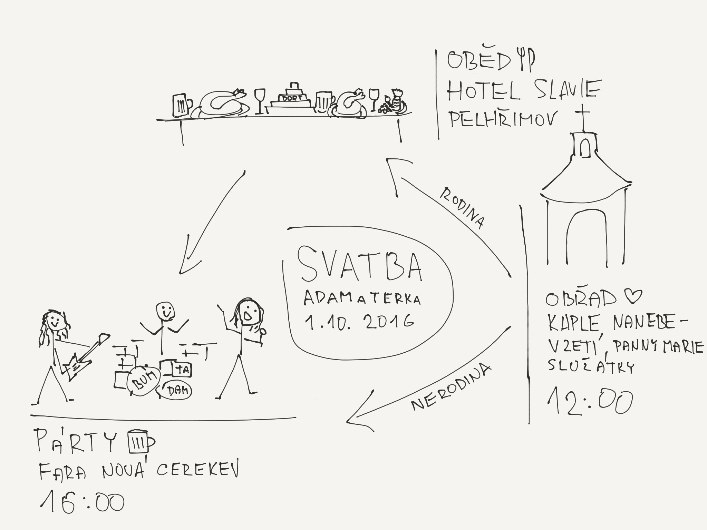

### Obřad bude 1. října ve Služátkách u kapličky Nanebevzetí Panny Marie. Přijde i pan farář.

Kaplička je to moc hezká a maj tam teďka nový obrazy. Nebo tedy nově starý, ale zrestaurovaný.
A když by někdo nevěděl, kde taková kaplička je, tak [mapy.cz to vědí](https://mapy.cz/s/YrsU).
Cesta z [Prahy na <i class="fa fa-bicycle" aria-hidden="true"></i>](https://www.strava.com/activities/338367643) trvá něco přes 4 hodiny, ale můžete použít i alternativní způsoby dopravy, třeba běh nebo auto.

>Pokud jste sem došli přes pozvánku, tak jste asi zvaný, pokud ne a myslíte si, že byste neměli chybět, tak nám napište, někde v rohu se třeba místo najde.
Jo jinak obřad je veřejnej, tak prostě přijdťe.

### Po obřadu bude rodinný oběd a následně veselice na faře v Nové Cerekvi.

Fara je to moc hezká, jinak bysme to tam nedělali a pro nemístňáky máme znovu i odkaz na [mapy.cz](https://mapy.cz/s/XNqa). Ze Služátek je to trochu do kopce, ale [na  <i class="fa fa-bicycle" aria-hidden="true"></i> kousek](https://www.strava.com/routes/6157429) a kdo chce, tak může i [bežet](https://www.strava.com/routes/6157429) nebo jet autem.

### Na faře začínáme hodinu po třetí.

Tedy 16:00 start. Nějaké menší občerstvení bude k dispozici možná dříve, detaily ladíme a snad něco uvaříme. A narazíme sud.

> Doporučená výbava viz obrázek níže <i class="fa fa-arrow-down" aria-hidden="true"></i>
. Spaní bude možné na zemi na faře ve velké místnosti v podkroví. Případně na zahradě. Každopádně se bude hodit spacák, matrace tam jsou, ale karimatka je jistotou. Bude říjen a doufáme v babí léto <i class="fa fa-spin fa-sun-o" aria-hidden="true"></i>
, ale může být k večeru zima, tak s tím počítejte. A když bude pršet, tak se dovnitř asi všichni pohodlně nevejdeme. Takže <i class="fa fa-umbrella" aria-hidden="true"></i>
 taky s sebou. Dále bežecké boty. Třeba se budou hodit. <i class="fa fa-smile-o" aria-hidden="true"></i>

### Máme už i program

Tedy tak trochu. A můžete si ho [vytisknout](images/IMG_0117.jpg) - abyste se neztratili. Ale nemusíte.

>Po obřadu se rodina odebere na společný slavnostní oběd <i class="fa fa-cutlery" aria-hidden="true"></i>
 do hotelu Slavie v Pelhřimově na náměstí. Tam si dáme něco dobrého, trochu vydechneme <i class="fa fa-coffee" aria-hidden="true"></i>
 a budeme pokračovat na faru.
Ti kdo nejdou na oběd, tak mají rozchod. Sraz je na faře ve čtyři <i class="fa fa-clock-o" aria-hidden="true"></i>
, budeme se snažit, aby tam byl třeba guláš a něco k pití už o trochu dříve <i class="fa fa-beer" aria-hidden="true"></i>
. Počítám, že to na kole nezabere tolik času a že bude hlad.
Program na faře bude potom "volná zábava" <i class="fa fa-music" aria-hidden="true"></i>
. Možná přijde i kouzelník <i class="fa fa-magic" aria-hidden="true"></i>
.

### Vstup je zdarma

a ze všech stran, ale ideální bude přijít bránou. Pokud byste nás chtěli něčím obdarovat, tak [můžete](https://paper.dropbox.com/doc/Svatebn--aCw0HP3O89b11gIUlUArW).

## Adam a Tereza
